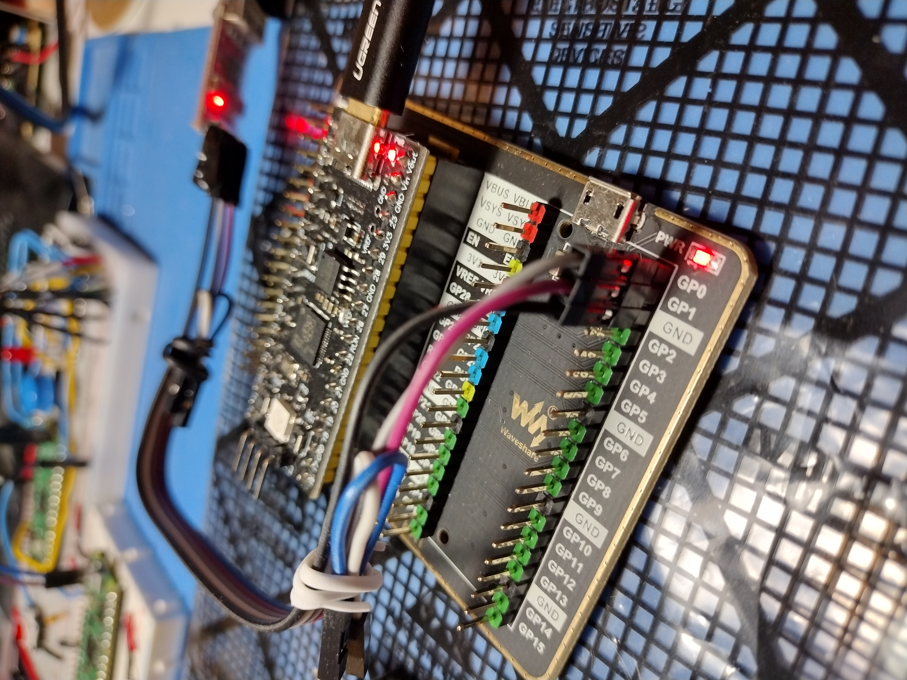

# Description
xxx

# UART setup for communication
Using minicom we need to turn off *Hardware Flow Control*. Press:

- Ctrl-A
- o
- select "Serial port setup"
- f

This disables flow-control so you talk to the pico.

Also, you can save the configuration as a *.dfl* file. This file will placed in you $HOME directory and named **.minirc.dfl**.

# Minicom
In order to skip reconfiguring Hardware Flow Control each time. I created a minirc configuration file and copied it to */etc/minicom/minirc.pico_io*. The contents are simple:

```
pu rtscts           No
```

Now you can start minicom using that configuration:
``` $ minicom -b 115200 -o -D /dev/ttyUSB0 pico_io ```

Make sure you connect your UART to the correct pins on your pico board. Is this case I have a pico clone and expander board:



# Build
See root readme.md for creating and configuring project prior to running *make*

```
$ cd build/io_uart
$ make
```

# Upload
## Via Picoprobe
sudo openocd -f interface/picoprobe.cfg -f target/rp2040.cfg -c "program io_uart.elf verify reset exit"

## Via drag/drop UF2
- hold Reset and Boot
- let go of Reset
- let go of Boot
- Wait for it to mount.
- Then copy or drag the *.uf2* file to the mounted drive.

```$ cp io_uart.uf2 /media/<path to uf2>/RPI-RP2```


# Misc
If we wanted to code an NCurses control panel we would need some extra cpp code:

https://blog.mbedded.ninja/programming/operating-systems/linux/linux-serial-ports-using-c-cpp/

https://www.reddit.com/r/raspberrypipico/comments/uc9v1r/issue_with_readingwriting_uart_when_programming/