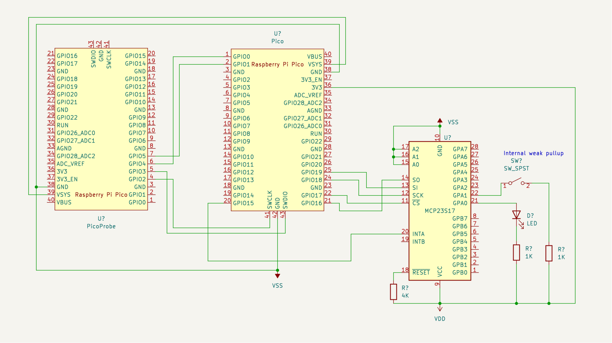

# Upload
sudo openocd -f interface/picoprobe.cfg -f target/rp2040.cfg -c "program mcp23s17.elf verify reset exit"

# Configuring MCP
The MCP is powered at 3.3v because we need to route MISO into the PICO to sense an interrupt. The PICO's pins **ARE NOT** 5v tolerant.
If we didn't need to use MISO then we could have just powered the MCP at 5v.

## Build
See parent [README.md](../README.md) for build directions

- Using Bank 1
- Using only Port A
- Configured for Byte mode.

## Diagram


### Pins
- GPA0 = input button
- GPA1 = output LED
- GPINT0 = 1

## On power up
Most of the defaults are taken.

- All gpio are inputs. Except for what we will change.
- Polarity is non-inverted (bits cleared in IPOL) *default*

## Registers

### IOCON
Because we are using only Port A it is easier to configure register mapping as Bank=1

- BANK = 1 = separate banks
- MIRROR = 0 = Not connected
- SEQOP = 1 = Sequential diabled
- DISSLW = x = don't care. but set to 0 nonetheless
- HAEN = 0 = Disabled. We are not using addresses
- ODR = 0 = Standard Active driver. INTPOL set polarity
- INTPOL = 0 = configures for Active-low output signal
- UNUSED = 0

reg = 1010_0000 = 0xA0

### IODIR A
Configures GPA0 as Input. The rest are outputs.
- IODIRA 0000_0001

### IPOL A
All bits are 0

### GPINTEN A
Enables GPA0 as interrupt-on-change. The rest are disabled.

reg = 0000_0001

### INTCON
All bits are cleared except for bit 0. This configures for comparisons against previous values.
```
              v
reg = 0000_0001
              |
```
Setting bit0 configures for comparison against DEFVAL

### DEFVAL
We want to detect when a button is pressed. The pin is pulled weakly high via GPPU register. When the pin is pressed it is pulled to ground thus making it an Active-low pin input.

```
              v
reg = 0000_0001
              |
```
This means that bit0 needs to be Set because grounding the pin causes a change-detection because 1 != 0

The button can be debounced via a Cap and Resistor.

### GPPU
We Set bit0 to configure the pin as pulled-up via an internal 10k resistor. The rest are not pulled up.

```
              v
reg = 0000_0001
              |
```

### INTF
This register is ignored. The PICO will be sensing INTA output in.

### INTCAP
When the PICO is interrupted it will turn around and read the GPIO register which will also clear INTCAP.

### GPIO
This register is read when an interrupt occurs.

### OLAT
Not used.

# Interrupt condition
Section 3.6.5 of Spec sheet.

I configured the interrupt conditions using **Interrupt on change from register value** which will cause an interrupt to occur if the pin differs from the DEFVAL bit. The interrupt remains *as long as the pin differes* regardless if either INTCAP or GPIO is read.

# Pico configure

## SPI
Pins
- #39 = VSYS = 3.3v
- #38 = Gnd

Notes:

Three bytes are required to update a single register. Therefore, if a comparison-based interrupt is requested, then both ports of all three registers are written at once to optimize the transfer by one byte.

Otherwise, if a change-based interrupt is requested, then it is more efficient to write two transactions to the to the specific ports and registers.

# Links
- https://docs.particle.io/reference/device-os/libraries/m/mcp23s17/
- Arduino https://github.com/RobTillaart/MCP23S17

